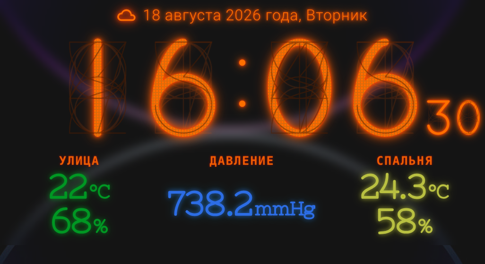

# reNix Clock Card
<p align="center">
  
</p>
A custom Home Assistant Lovelace card with a layered reNix tube-style clock, weather/date information and configurable sensor panels.

## Version

**1.0.0 — stable release**

## Features

- Integrated `reNix-Regular.woff2` font.
- 24-hour clock with seconds and grid layers.
- Weather icon, date and weekday.
- Outside temperature/humidity, pressure and room temperature/humidity.
- Pressure displayed to one decimal place.
- Independent night brightness for upper and lower sections.
- Configurable clock glow and colors through the visual editor.
- Frosted Glass blur support.
- Theme-controlled card background, border, shadow and radius when set to `null`.

## Installation

### HACS

The easiest way to install Renix Clock Card is through HACS.

1. Open **HACS** in Home Assistant.
2. Go to **Frontend**.
3. Click the three-dot menu in the top-right corner.
4. Select **Custom repositories**.
5. Add:

   `https://github.com/vasques666/renix-clock-card`

6. Select **Dashboard** as the repository type.
7. Click **Add**.
8. Find **Renix Clock Card** and install it.
9. Restart Home Assistant or reload the Lovelace resources.

### Manual installation

Download `renix-clock-card.js` from the repository and add it as a Lovelace resource.

## Example

See [`example.yaml`](example.yaml).

## Установка

### HACS

Самый простой способ установить **Renix Clock Card** — через HACS.

[](https://my.home-assistant.io/redirect/hacs_repository/?owner=vasques666&repository=renix-clock-card&category=dashboard)

#### Установка через кнопку HACS

1. Нажмите кнопку **Open in HACS** выше.
2. Home Assistant откроет страницу **Renix Clock Card** в HACS.
3. Нажмите **Download** / **Скачать**.
4. После установки перезагрузите Home Assistant или обновите ресурсы Lovelace.

#### Установка как Custom Repository

Если кнопка выше не работает:

1. Откройте **HACS**.
2. Перейдите в раздел **Frontend**.
3. Нажмите меню **⋮** в правом верхнем углу.
4. Выберите **Custom repositories** / **Пользовательские репозитории**.
5. Введите адрес репозитория:

   `https://github.com/vasques666/renix-clock-card`

6. В поле типа репозитория выберите **Dashboard**.
7. Нажмите **Add**.
8. Найдите **Renix Clock Card** в HACS.
9. Нажмите **Download** / **Скачать**.
10. Перезагрузите Home Assistant.

### Ручная установка

Если вы не используете HACS:

1. Скачайте файл `renix-clock-card.js` из репозитория.
2. Скопируйте его в каталог:

   `/config/www/`

3. Добавьте ресурс Lovelace:

   ```yaml
   resources:
     - url: /local/renix-clock-card.js
       type: module
